  # Evidencia de la semana · GitHub Copilot

  **Alumno:** Saul Eduardo Hernández Rodríguez · **Repo:** https://github.com/SaulHR04/taskflow-copilot-saulhr04

  ## Día 1 · La CLI

  - **Qué construí:** Configuré las instrucciones de GitHub Copilot para el repositorio y documenté la arquitectura de TaskFlow.
  - **Dónde está:** `.github/copilot-instructions.md`, `docs/ARQUITECTURA.md`.
  - **Cómo se comprueba:** `evidencia/dia1/verificador.txt`, última línea: `0 NO EXISTE`.
  - **Qué no salió:** nada.

  ## Día 2 · Especificar, implementar y revisar

  - **Qué construí:** Implementé los endpoints para consultar tareas vencidas y tareas sin responsable.
  - **Dónde está:** `specs/overdue.md`, `src/main/java/com/taskflow/controller/TaskController.java`, `src/main/java/com/taskflow/service/TaskService.java`.
  - **Cómo se comprueba:** `evidencia/dia2/suite-main.txt` registra `72` pruebas, sin fallos ni errores; el PR está en `evidencia/dia2/pr.txt`.
  - **Qué no salió:** nada aunque se provocó intencionalmente un fallo en la ordenación de tareas vencidas y se restauró el código después de comprobar que las
  pruebas lo detectaban.

  ## Día 3 · MCP

  - **Qué construí:** Configure e hice uso de los servidores MCP de TaskFlow, GitHub, AWS Knowledge y Playwright; el agente consultó tareas vencidas y creo un
  issue en GitHub.
  - **Dónde está:** `taskflow-mcp/`, `evidencia/dia3/mcp-list.txt`, `evidencia/dia3/integrador.md`, `evidencia/dia3/playwright-tarea.txt`.
  - **Cómo se comprueba:** `evidencia/dia3/conteos.txt` confirma una tarea vencida y un issue creado; `playwright-tarea.txt` muestra la tarea creada
  mediante Playwright.
  - **Qué no salió:** nada. 

  ## Día 4 · Skills y agentes

  - **Qué construí:** Creé skills para implementar endpoints, verificar TaskFlow y limpiar AWS, además configure los agentes `revisor`, `tester` y `auditor-
  aws`.
  - **Dónde está:** `.github/skills/`, `.github/agents/`, `evidencia/dia4/`.
  - **Cómo se comprueba:** `evidencia/dia4/verificar.txt` termina con `RESULTADO: 8/8 OK`.
  - **Qué no salió:** inicialmente el revisor busco la carpeta `evidence` y recibió el error `Path does not exist`; posteriormente localizó la ruta correcta
  `evidencia` y completó la revisión.

  ## Día 5 · VS Code y proyecto final

  - **Qué construí:** Implementé el endpoint `PATCH /tasks/{id}/assignee` para reasignar responsables, con validaciones, pruebas, revisión de Copilot y pull
  request integrado.
  - **Dónde está:** `specs/assignee.md`, `semana6/README.md`, `src/main/java/com/taskflow/controller/TaskController.java`, `src/main/java/com/taskflow/
  service/TaskService.java`.
  - **Cómo se comprueba:** `semana6/README.md` registra `RESULTADO: 16/16 OK` y el PR integrado es
  https://github.com/saulhr04/taskflow-copilot-saulhr04/pull/5.
  - **Qué no salió:** el primer código generado tenía dos detalles incorrectos en una prueba del caso `422`; fueron detectados por Copilot code review y
  corregidos.

 -----------
### Configuración UTF-8

 configuración UTF-8 durante el desarrollo del proyecto.

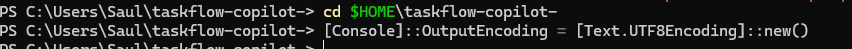

### Revisión archivos

 revisión archivos durante el desarrollo del proyecto.

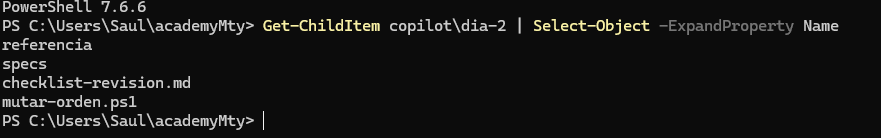

### Revisión login

 revisión login durante el desarrollo del proyecto.

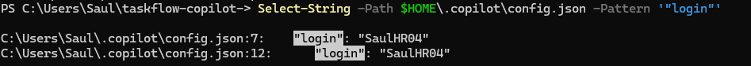

### Herencia sub agentes de GPT

 herencia Sub Agentes de lo GPT  

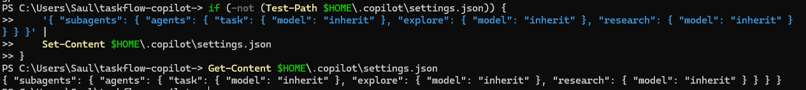

### Comprobación de test

 la validación realizada para confirmar test.

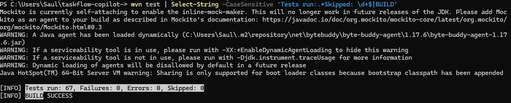

### Branch nueva

 branch Nueva feature/overdue.

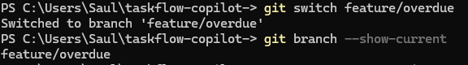

### Creación y comprobación carpeta Specs

 la validación realizada para confirmar carpeta specs.

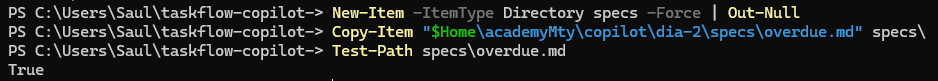

### Comprobación Usage

 la validación realizada para confirmar usage.

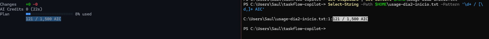

### Creación y comprobación carpeta Specs

 la validación realizada para confirmar carpeta specs.

### Prompt 1

 la instrucción enviada para solicitar 1.

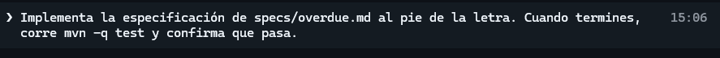

### Resultado prompt 1

 la respuesta generada por el agente tras procesar la instrucción.

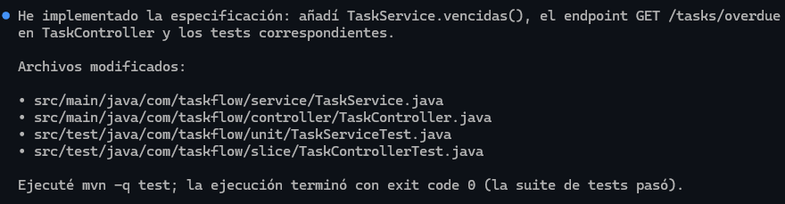

### Test PS2

 la ejecución de las pruebas y el resultado obtenido.

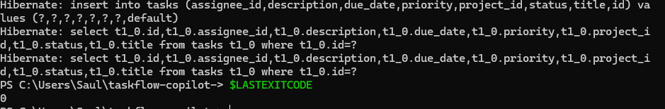

### Comprobar test existentes

 la validación realizada para confirmar test existentes.

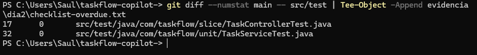

### Failure en test

 la ejecución de las pruebas y el resultado obtenido.

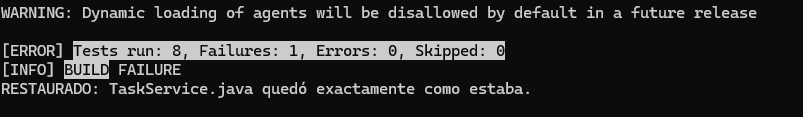

### Task

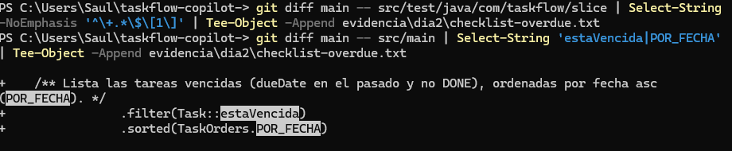

### Comprobación test

 la validación realizada para confirmar test.

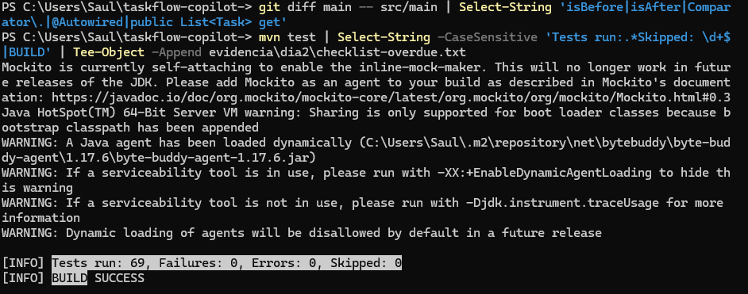

### Revisión con prompt

 revisión Con prompt de lo que se cambio en la rama. 

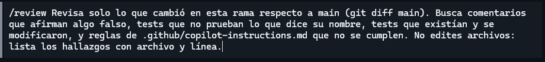

### Comprobación

 la validación realizada para confirmar el resultado de la actividad.

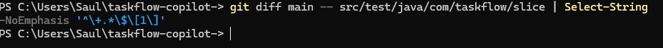

### Rama commit comprobación

 Commit para la spec get/task/unassigned

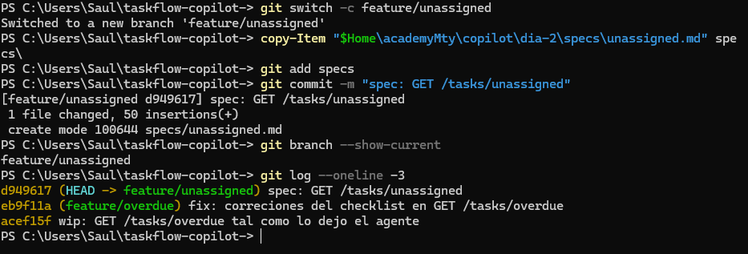

### Prompt Plan

 prompt enviado para solicitar plan.

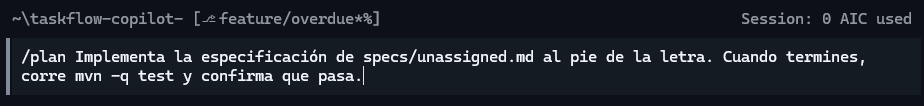

### Rama experimento

la gestión de la rama utilizada durante el desarrollo.

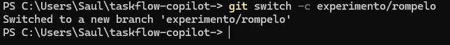

### Test Failure Rama 3

ejecución de las pruebas y el resultado obtenido de los test .

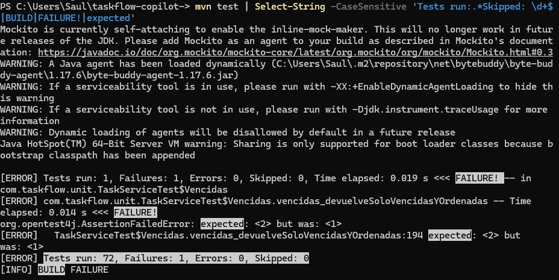

### Prompt Test Fallan

la instrucción enviada para solicitar a copilot los test fallan.

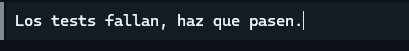

### Comprobación de Eliminación de bug

 la validación realizada para confirmar eliminación de bug.

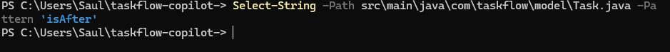

### Comprobación bug corregido

 la validación realizada para confirmar bug corregido.

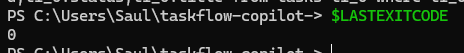

### Eliminación Branch

 eliminación Branch durante el desarrollo del proyecto.

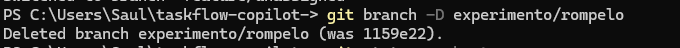

### Branch Eliminada

 branch Eliminada durante el desarrollo del proyecto.

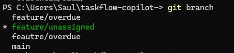

### Pull Request

 la preparación o revisión de los cambios para su integración.

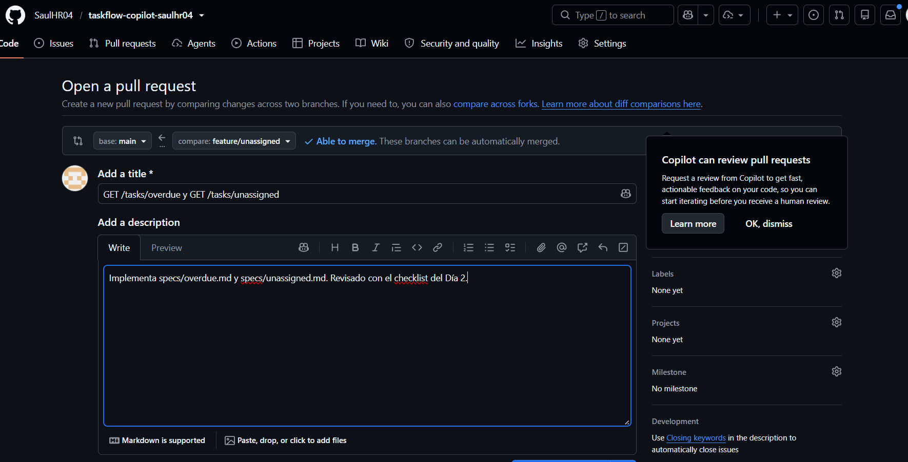

### Merge Realizado

 la integración de los cambios en la rama correspondiente.

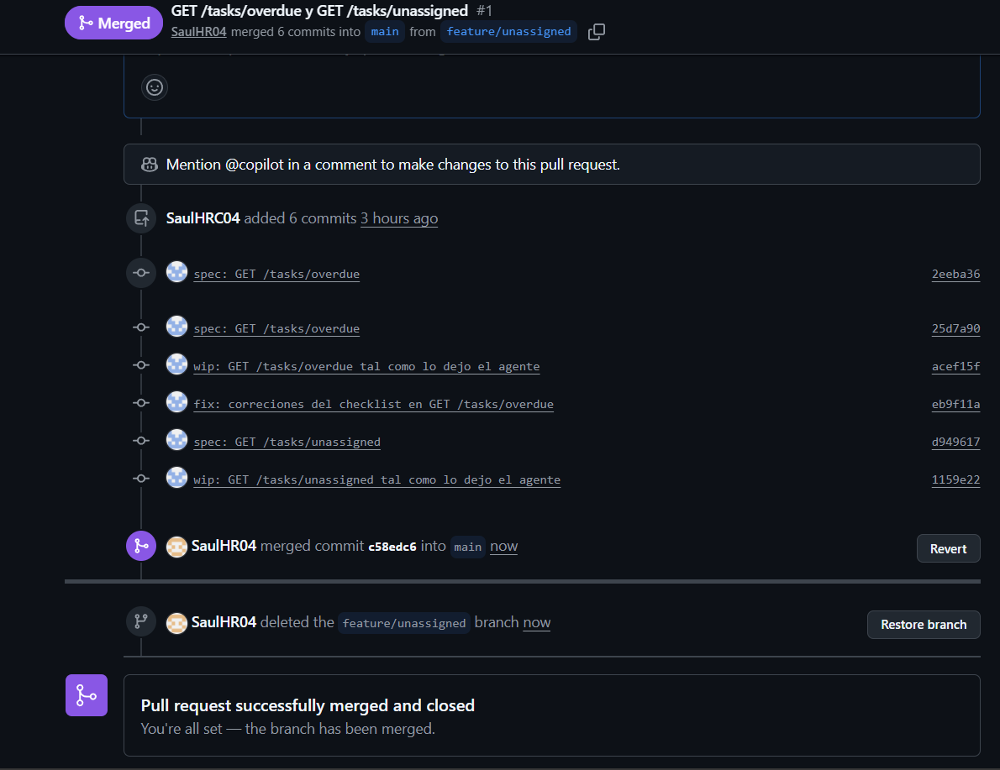

### Copilot Revisión

 copilot Revisión durante el desarrollo del proyecto.

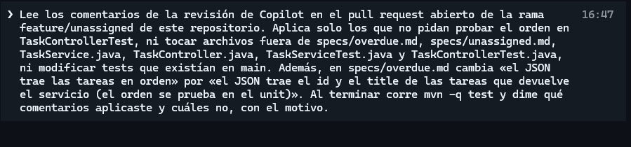

### Comprobación Final

 la validación realizada para confirmar final.

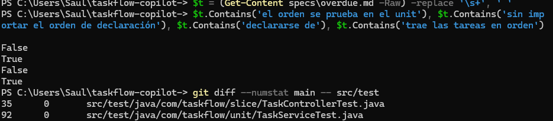

### Comprobación Final

 la validación realizada para confirmar final2.

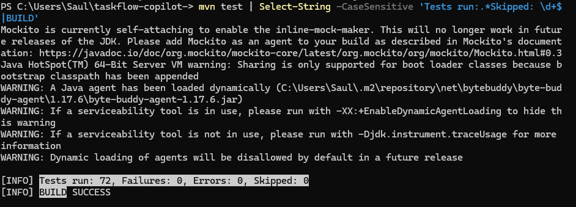

### Resultado Final
 

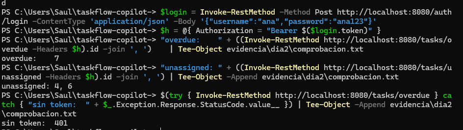

### Generar Enlace PR

 generar enlace PR durante el desarrollo del proyecto.

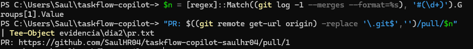

### Usage Final

 usage final durante el desarrollo del proyecto.

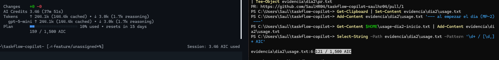

### Spring No Responde

 spring No Responde durante el desarrollo del proyecto.

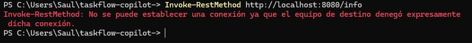

### Borrar Rama

 la gestión de la rama utilizada durante el desarrollo.

## Día 3

 inicio día 3 

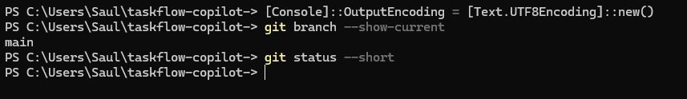

### Pull y carpeta Copilot día 3

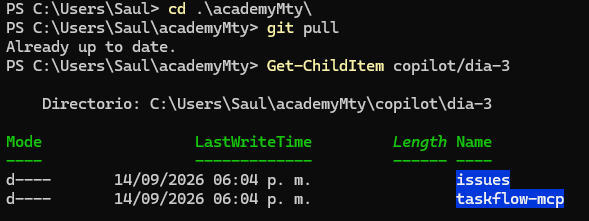

### Endpoints

 endpoints durante el desarrollo del proyecto.

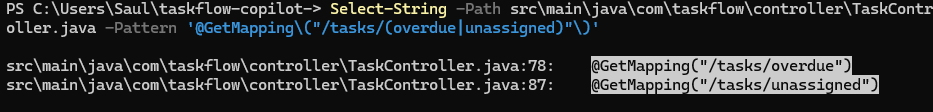

### Comprobación repositorio

 la validación realizada para confirmar repo.

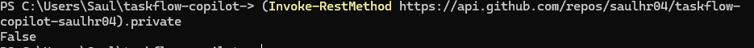

### Version NPX

 version NPX durante el desarrollo del proyecto.

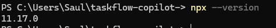

### Copiar y compilar Servidor MCP

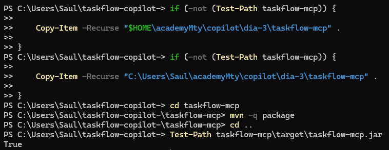

### Play Wright MCP

 Instalacion de play Wright MCP.

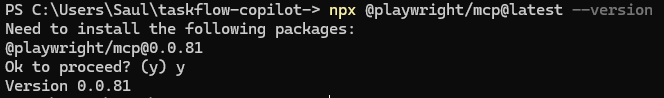

### Arrancar Task Flow

 el inicio del servicio y la confirmación de que se encuentra disponible.

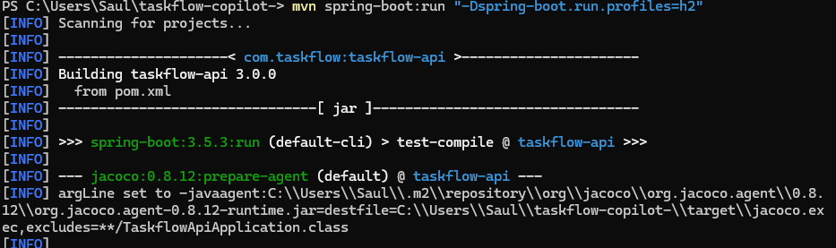

### Task Flow Iniciado

 el inicio del servicio y la confirmación de que se encuentra disponible.

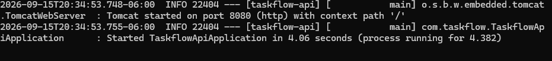

### No MCP Configurado En Copilot

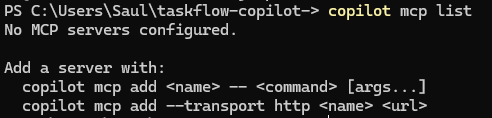

### Copilot Comando MCP

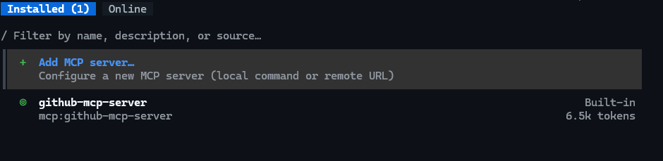

### Preparar incidencia

 el registro y seguimiento de una incidencia relacionada con el trabajo realizado.

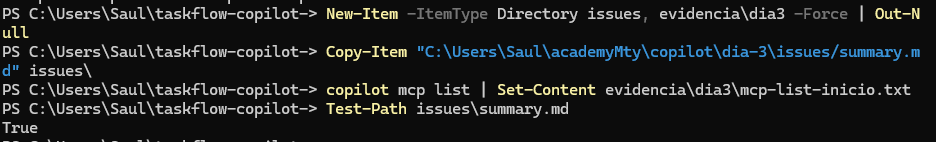

### Iniciar Copilot Con ALL GitHub MCP

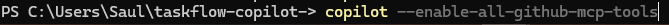

### Crear incidencia Con Copilot

 el registro y seguimiento de una incidencia relacionada con el trabajo realizado.

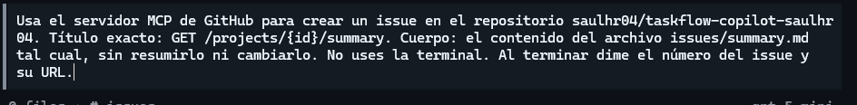

### Incidencia Creado

 el registro y seguimiento de una incidencia relacionada con el trabajo realizado.

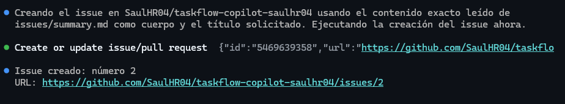

### Incidencia En GitHub

 el registro y seguimiento de una incidencia relacionada con el trabajo realizado.

### Comparar Object

 comparar Object durante el desarrollo del proyecto.

### Registrar AWS Knowledge

 registrar AWS Knowledge durante el desarrollo del proyecto.

### Prompt Disponibilidad

 la instrucción enviada para solicitar disponibilidad.

### Compartir Sesion AWS

 compartir Sesion AWS durante el desarrollo del proyecto.

### Test Compartido AWS

 la ejecución de las pruebas y el resultado obtenido.

### Comprobación Productos Servidor MCP

 la validación realizada para confirmar productos servidor mcp.

### Registrar Play Wright

 registrar Play Wright durante el desarrollo del proyecto.

### Copilot List

 copilot List durante el desarrollo del proyecto.

### Prompt crear tarea

 prompt enviado para solicitar crear tarea.

### Agente funcionando

### Flujo Del Agente y Compartido De Sesion

### Revisión Script PS

### Comprobar Si No Uso Herramientas Prohibidas

 la validación realizada para confirmar no uso herramientas prohibidas.

### Comprobar Task Flow Test

 la validación realizada para confirmar task flow test.

### Comprobar Herramientas

 la validación realizada para confirmar herramientas.

### MCP Lista

### Com MCP Copilot

### Prompt Tareas Vencidas

prompt enviado para solicitar tareas vencidas.

### Prompt Crear Tarea

 la instrucción enviada para solicitar crear tarea.

### Creación Token y Comprobación

 la validación realizada para confirmar el resultado de la actividad.

### Comprobación Tarea Creada

 la validación realizada para confirmar tarea creada.

### Task Flow Apagado y Prompt Listar Tareas

### Copilot No Arranco

### Actualizacion Con Due Date Intacto

### Creación incidencia Tareas Vencidas

 el registro y seguimiento de una incidencia relacionada con el trabajo realizado.

### Comprobación Share File

 la validación realizada para confirmar share file.

### Comprobación PS

 la validación realizada para confirmar ps.

### Commit día3

 el registro de los cambios realizados en el repositorio.

### Limpieza

 la limpieza efectuada al concluir la actividad.

## Día 4

### Skills Copilot

### Romper Skill

### Arreglar Skill

### Invocación Vía Skill

### Ejecución Skill Prompt

### Resultado Copilot Prompt

### Resultado Test Despues De Prompt

### Comprobación Skill Cargada

 la validación realizada para confirmar skill cargada.

### Limpieza Transcript

### Script Apagar Task Flow

### Prompt Ejecutado Por Agente

### Creación De Agentes Revisor y Tester

 la ejecución de las pruebas y el resultado obtenido.

### Agentes en copilot

### Prompt Revisión

 el prompt enviado para solicitar revisión.

### Resultado de prompt y comprobación

 la respuesta generada por el agente tras procesar la instrucción.

### Prompt rompelo a propósito

 la instrucción enviada para solicitar y romperlo a propósito.

### Prompt corregir Lo Roto

 la instrucción enviada para solicitar corregir lo roto.

### Prompt Tester

 la instrucción enviada para solicitar tester.

### Repeticion Prompt Por Error 

 repeticion Prompt por error (correccion para el error)

### Test Arreglado

 la ejecución de las pruebas y el resultado obtenido.

### Limpieza y Commit

 el registro de los cambios realizados en el repositorio.

### Configuración perfil AWS

### Arn

### Copilot skill / list Skills

### Auditoría y escritura que falla

### Comprobación de auditoría

 la validación realizada para confirmar auditoría.

### Comprobación que no puede escribir

 la validación realizada para confirmar que no puede escribir.

### Sacar transcript y comprobación

 la validación realizada para confirmar el resultado de la actividad.

### Romper a propósito

### Resultado romper a propósito

### Fallas en tareas

### Arreglado test 8 de 8

 la ejecución de las pruebas y el resultado obtenido.

### Borrar info privada

 borrar info privada para preparar el push.

### Comparar y PR

 la preparación o revisión de los cambios para su integración.

### Confirmar Merge

### Evidencia 4

### Limpieza y encender MCP

### Limpieza Cloud Shell

### Limpieza Terminada

## Día 5

### Academy Mty Lista

### Check List antes de comenzar

### Instalacion extension copilot

### Visual con Copilot Pro

### Previsualizacion

### Auto Completado Automatico

### Restaurar Task Service 

### Inferior de visual studio configurado

### Prompt 1

### Prompt Agent

 la instrucción enviada para solicitar agent.

### Run PWSH

### Suit De Test Paso

 la ejecución de las pruebas y el resultado obtenido.

### Instructions Chat

### Menu Instrucciones

### Skills Menu

### Elegir Revisor

### Revisor No Puede Modificar

### Revisar Servidores

### Arrancar API

### Server Running

### Herramienta Usada

### Mismo ID

### Commit y push

 el registro de los cambios realizados en el repositorio.

### Crear nueva rama

### Copiar MD

### Prompt Implementar Skill

 la instrucción enviada para solicitar implementar skill.

### Prompt Resultado

### Test Add Status

 la ejecución de las pruebas y el resultado obtenido.

### Revisor Con Prompt

### Resultado Prompt Revisor

### Comprobación Prompt Revisor

### Agregar Feature

### Comprobación Verificador Assignee

### Resultado prueba punta a punta

### Commit y Push 
.

### PR En GitHub

 la preparación o revisión de los cambios para su integración.

### Copilot Request

### Review Copilot Git Hub

### Re-Review Copilot

### Re Review Copilot 2

 Comentarios de copilot en el review.

### Merge

 la integración de los cambios en la rama correspondiente.

### Comprobación Merge

 la validación realizada para confirmar merge.

### Comprobación 

 la validación realizada para confirmar todo correcto desde PS.

### Verificacion de huecos en la plantilla

 ## Cierre

  - **Créditos:** En el proyecto final se usaron `10.31` AI Credits: `5.18` para implementación, `2.06` para revisión y `3.07` para correcciones. El
  registro general de septiembre indica `246.23` AI Credits, incluyendo semanas anteriores.
  - **Qué haría distinto para gastar menos:** Entregarle al agente únicamente los archivos y criterios de aceptación necesarios y haria una revisión manual antes de solicitar correcciones.

  ## Una cosa que el agente hizo mal

  El agente creó la prueba `patchAssignee_tareaDone_devuelve422` con una tarea en estado `TODO`, aunque el caso representaba una tarea terminada. 
  code review detecto el problema y tambien puso que faltaba comprobar el mensaje exacto del error `422`. al final la prueba se corrigio usando
  `TaskStatus.DONE`.